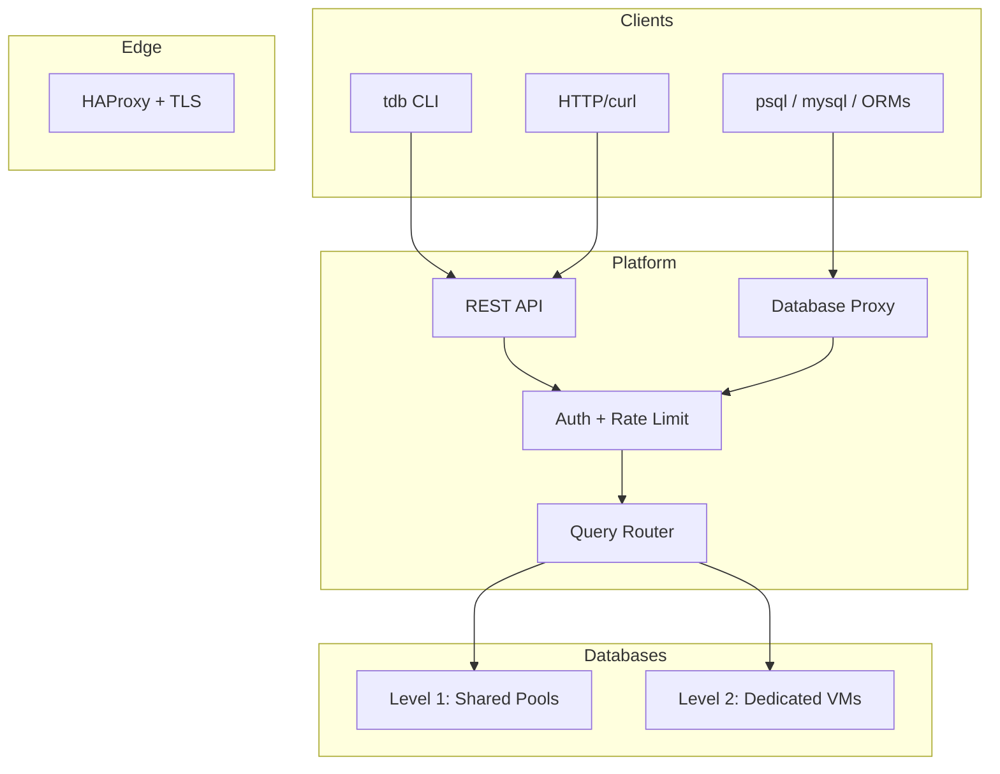
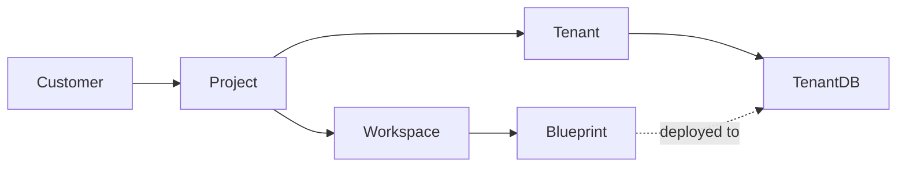

# Architecture

## System Flow


## Data Hierarchy


## Isolation Levels

**Level 1: Shared**
- Multi-tenant connection pool
- Cost-effective
- Good for startups, dev/test

**Level 2: Dedicated**
- Own VM per tenant
- Full isolation
- Enterprise, compliance

## Request Flow
```
1. Client connects (CLI / HTTP / psql)
2. HAProxy terminates TLS
3. Auth validates API key or tenant credentials
4. Router looks up tenant → database mapping
5. Query routed to correct isolated database
6. Response returned
```

## Pricing Tiers

- 🆓 **Free** — 5 tenants
- 🟢 **Starter** — 100 tenants ($79/mo)
- 🟡 **Growth** — 500 tenants ($249/mo)
- 🔵 **Scale** — 2000 tenants ($499/mo)
- 🟣 **Enterprise** — Unlimited (custom)